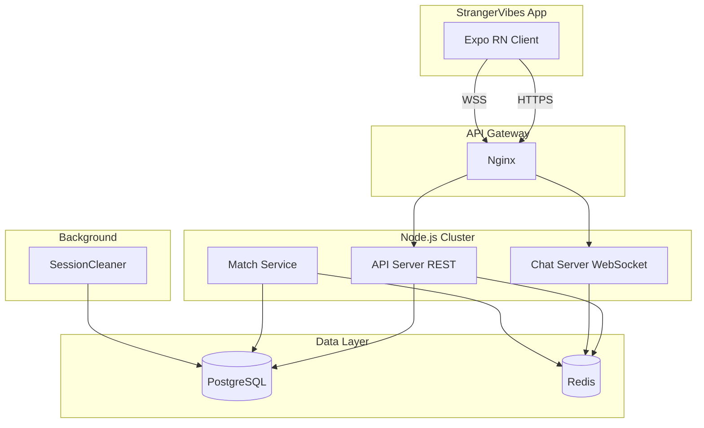

# 匿名聊天匹配应用 0-1 开发计划

## 技术选型确认

| 项目  | 选择              | 说明                                          |
| --- | --------------- | ------------------------------------------- |
| 认证  | Node 自有 REST 认证 | POST /user/register, /user/login，需修改 App 登录 |
| 数据库 | PostgreSQL      | 与 PRD 的 MySQL 结构等价，便于后续与 Supabase 数据互通      |
| 范围  | 全链路 MVP         | 后端 + App 接入，真人匹配 + 实时聊天                     |

---

## 架构总览

---

## 第一阶段：基础设施与项目骨架

### 1.1 项目初始化

**目标**：在 `alter` 目录创建 Node.js 后端项目结构。

**产出**：

- `chat-server/` 目录，按 PRD 第 2 节的目录结构创建
- `package.json`：Express、ws、pg、ioredis、jsonwebtoken 等依赖
- `config/`：db.js, redis.js, config.js
- `utils/response.js`：统一 `{ code, msg, data }` 格式

**检查点**：

- 阅读 [PRDs/PRD.md 第 2 节](e:\aiapp\alter\PRDs\PRD.md) 项目目录结构

---

### 1.2 数据库 schema（PostgreSQL）

**目标**：按 PRD 创建 PostgreSQL 表，并兼容 StrangerVibes 概念。

**核心表**（参考 PRD 第 3 节，适配 PostgreSQL）：

- `users`：id, uuid, nickname, avatar, gender, coin, password_hash, created_at
- `personality_types`：id, key, name, is_premium（seed 与 StrangerVibes 的 12 种人格一致）
- `daily_sessions`：user_id, personality_type, session_date（对应 StrangerVibes 的「今日性格」）
- `user_personality` / `personality_stats`：用户各人格使用次数、评分
- `chat_sessions`：user_a, user_b, personality_a, personality_b, start_time, expire_time, status
- `daily_matches`：user_id, matched_user_id, session_date, last_message...（今日匹配列表，供 App 聊天列表）
- `chat_history_users`：user_id, target_user_id, chat_count, last_chat_time
- `reports`、`user_stats` 等

**检查点**：

- 阅读 [PRDs/PRD.md 第 3 节](e:\aiapp\alter\PRDs\PRD.md) 数据库结构
- 对照 [StrangerVibes-main/supabase/functions/select-personality](e:\aiapp\StrangerVibes-main\supabase\functions\select-personality\index.ts) 与 [get-daily-matches](e:\aiapp\StrangerVibes-main\supabase\functions\get-daily-matches\index.ts) 使用的表结构
- 对照 [constants/theme.ts](e:\aiapp\StrangerVibes-main\constants\theme.ts) 的 12 种人格 key 做 seed

---

### 1.3 Docker 环境

**目标**：本地一键启动 PostgreSQL + Redis + Node。

**产出**：

- `docker-compose.yml`：api、postgres、redis 服务
- 可选的 `.env.example`

**检查点**：

- 阅读 [PRDs/PRD.md 第 14 节](e:\aiapp\alter\PRDs\PRD.md) Docker 部署

---

## 第二阶段：用户与人格模块

### 2.1 用户认证（REST）

**目标**：实现 PRD 中的 `/user/register`、`/user/login`、`/user/info`。

**实现要点**：

- 注册：nickname、avatar、password（或手机号 + 验证码，MVP 可先简化为密码）
- 登录：返回 JWT（或自定义 token）
- `middleware/auth.js`：校验 token，注入 req.userId

**检查点**：

- 阅读 [PRDs/PRD.md 第 11 节](e:\aiapp\alter\PRDs\PRD.md) API 系统
- 对照 [StrangerVibes-main/services/authService.ts](e:\aiapp\StrangerVibes-main\services\authService.ts) 了解 App 期望的登录流程（phone + OTP）

**注意**：StrangerVibes 使用手机号 + OTP。若 MVP 暂不做短信，可先用「手机号 + 固定验证码」模拟。

---

### 2.2 人格模块

**目标**：实现 `GET /personality/list`、`POST /personality/use`（今日选择）、`POST /personality/unlock`。

**实现要点**：

- `personality/use` 对应 StrangerVibes 的 `select-personality`：写入 `daily_sessions`，更新 `personality_stats`
- `session_date` 与 StrangerVibes 一致：3 AM CST 重置（见 `_shared/session.ts`）

**检查点**：

- 阅读 [PRDs/PRD.md 第 11 节](e:\aiapp\alter\PRDs\PRD.md) 人格相关 API
- 对照 [select-personality/index.ts](e:\aiapp\StrangerVibes-main\supabase\functions\select-personality\index.ts) 与 [sessionService.ts](e:\aiapp\StrangerVibes-main\services\sessionService.ts) 的 `checkTodaySession`、`selectPersonality`

---

## 第三阶段：匹配系统

### 3.1 匹配队列与 Match Service

**目标**：实现 PRD 的「优先同人格匹配，30 秒后扩大范围」。

**Redis 结构**（PRD 第 6 节）：

- Key：`match:queue:{personality}`
- 数据：userId, timestamp

**流程**（PRD 第 7 节）：

1. 用户调用 `POST /match/start` → 入队
2. Match Worker 轮询或阻塞弹出，配对 user_a + user_b
3. 创建 `chat_sessions` 记录
4. 通过 WebSocket 向双方推送 match 成功

**检查点**：

- 阅读 [PRDs/PRD.md 第 6、7 节](e:\aiapp\alter\PRDs\PRD.md) 匹配逻辑与流程
- 对照 [StrangerVibes-main/hooks/useMatching.tsx](e:\aiapp\StrangerVibes-main\hooks\useMatching.tsx) 的匹配 UI 与状态（searching、matched）

---

### 3.2 创建 chat_session 与 daily_match

**目标**：匹配成功后写入 `chat_sessions` 和 `daily_matches`。

**逻辑**：

- `chat_sessions`：用于 WebSocket 会话、3 小时 TTL
- `daily_matches`：用于 App 的「今日聊天列表」（对应 `get-daily-matches`）

**检查点**：

- 阅读 [StrangerVibes-main/supabase/functions/record-match](e:\aiapp\StrangerVibes-main\supabase\functions\record-match\index.ts)
- 阅读 [sessionService.recordMatch](e:\aiapp\StrangerVibes-main\services\sessionService.ts) 的参数与调用时机

---

## 第四阶段：WebSocket 聊天

### 4.1 Chat Gateway

**目标**：实现 `wss://api.app.com/chat`，支持 `match`、`chat`、`leave`、`timeout` 等系统消息。

**消息格式**（PRD 第 5 节）：

- 上行：`{ type: "chat", text: "hello" }`
- 下行：系统消息 type 为 match、chat、leave、timeout

**Redis 存储**（PRD 第 4、8 节）：

- Key：`chat:session:{sessionId}`
- 结构：LIST，元素 `{ senderId, text, time }`
- TTL：10800 秒（3 小时）

**检查点**：

- 阅读 [PRDs/PRD.md 第 4、5、8 节](e:\aiapp\alter\PRDs\PRD.md) Redis 与 WebSocket
- 对照 [StrangerVibes-main/hooks/useChat.tsx](e:\aiapp\StrangerVibes-main\hooks\useChat.tsx) 的消息格式（role: me/them, text, time, status）

---

### 4.2 SessionCleaner Worker

**目标**：定时扫描过期 `chat_sessions`，更新 status，关闭对应 WebSocket。

**执行周期**：1 分钟（PRD 第 10 节）

**检查点**：

- 阅读 [PRDs/PRD.md 第 9、10 节](e:\aiapp\alter\PRDs\PRD.md) 聊天过期与 Worker

---

## 第五阶段：StrangerVibes 接入

### 5.1 配置与 API 基址

**目标**：在 StrangerVibes 中增加「后端模式」开关或环境变量，指向新 Node 后端。

**修改**：

- 新建 `constants/api.ts` 或扩展 `config.ts`：`API_BASE_URL`、`WS_URL`
- 区分开发/生产环境

---

### 5.2 认证接入

**目标**：登录流程改为调用 Node 的 `/user/register`、`/user/login`。

**修改**：

- [authService.ts](e:\aiapp\StrangerVibes-main\services\authService.ts)：`verifyOTP` 改为调用 Node API，保存返回的 token
- [AuthContext.tsx](e:\aiapp\StrangerVibes-main\contexts\AuthContext.tsx)：请求时附带 `Authorization: Bearer <token>`
- 如需兼容旧 Supabase，可保留双模式

**检查点**：

- 阅读 [authService.ts](e:\aiapp\StrangerVibes-main\services\authService.ts) 与 [AuthContext.tsx](e:\aiapp\StrangerVibes-main\contexts\AuthContext.tsx)

---

### 5.3 Session Service 接入

**目标**：`checkTodaySession`、`selectPersonality`、`getTodayMatches`、`recordMatch`、`ratePersonality` 改为调用 Node REST API。

**新建**：`services/backendApi.ts` 或改造 `sessionService.ts`，统一用 `fetch` + Bearer token 调用 Node 后端。

**检查点**：

- 阅读 [sessionService.ts](e:\aiapp\StrangerVibes-main\services\sessionService.ts) 全部接口
- 确保 Node 提供的 API 与现有入参/出参结构兼容

---

### 5.4 匹配逻辑接入

**目标**：`useMatching` 改为调用 `POST /match/start`，通过 WebSocket 接收 match 成功事件。

**修改**：

- [useMatching.tsx](e:\aiapp\StrangerVibes-main\hooks\useMatching.tsx)：移除 FAKE_USERS，改为：
  - 调用 `POST /match/start`
  - 建立 WebSocket 连接，监听 `match` 事件
  - 收到后设置 `matchedUser`（来自服务端推送的对方信息）

**检查点**：

- 阅读 [useMatching.tsx](e:\aiapp\StrangerVibes-main\hooks\useMatching.tsx) 与 [constants/config.ts FAKE_USERS](e:\aiapp\StrangerVibes-main\constants\config.ts)

---

### 5.5 聊天逻辑接入

**目标**：`useChat` 改为通过 WebSocket 收发真实消息。

**修改**：

- [useChat.tsx](e:\aiapp\StrangerVibes-main\hooks\useChat.tsx)：移除 MOCK_REPLIES
  - 进入聊天页时建立 WebSocket 连接（或复用全局 WS）
  - 发送：`{ type: "chat", text }`
  - 接收：解析 `chat` 类型消息，更新 messages 列表
  - 支持 `leave`、`timeout` 等系统消息的 UI 反馈

**检查点**：

- 阅读 [useChat.tsx](e:\aiapp\StrangerVibes-main\hooks\useChat.tsx) 与 [app/chat/[id].tsx](e:\aiapp\StrangerVibes-main\app\chat[id].tsx)

---

## 第六阶段：安全与收尾

### 6.1 安全措施（PRD 第 12 节）

- Rate limit（如 express-rate-limit）
- Spam 检测（Redis `spam:user:{userId}`）
- Report 接口 `POST /report`
- 黑名单（可选 MVP 后做）

**检查点**：

- 阅读 [PRDs/PRD.md 第 12 节](e:\aiapp\alter\PRDs\PRD.md) 安全系统

---

### 6.2 GET /chat/history

**目标**：会话内的历史消息可从 Redis 读取（未过期）或仅返回会话元信息。PRD 要求 `GET /chat/history`，可按 sessionId 拉取 Redis 中的消息列表。

---

### 6.3 联调与测试

- 端到端：注册 → 选人格 → 匹配 → 聊天 → 3 小时后过期
- 双机/双账号验证实时消息
- 检查 [PRDs/PRD.md 第 16 节](e:\aiapp\alter\PRDs\PRD.md) Cursor 提示词，确保实现与 PRD 一致

---

## 关键节点与文档对照表

| 阶段            | 完成时需检查的 PRD 章节 | 需对照的 StrangerVibes 文件                             |
| ------------- | -------------- | ------------------------------------------------- |
| 1.1 骨架        | 第 2 节          | -                                                 |
| 1.2 Schema    | 第 3 节          | select-personality, get-daily-matches, theme.ts   |
| 1.3 Docker    | 第 14 节         | -                                                 |
| 2.1 认证        | 第 11 节         | authService.ts, AuthContext                       |
| 2.2 人格        | 第 11 节         | sessionService, select-personality                |
| 3.1 匹配        | 第 6、7 节        | useMatching.tsx                                   |
| 3.2 记录        | 第 7 节          | record-match, sessionService.recordMatch          |
| 4.1 WebSocket | 第 4、5、8 节      | useChat.tsx, chat/[id].tsx                        |
| 4.2 Worker    | 第 9、10 节       | -                                                 |
| 5.x App 接入    | 第 11 节         | sessionService, useMatching, useChat, authService |
| 6.1 安全        | 第 12 节         | report.tsx, reportService                         |

---

## 依赖与前置条件

- Node.js 18+
- Docker / Docker Compose
- 可选：Nginx 作为反向代理（本地开发可直接连 Node 端口）

---

## 待对齐问题（可选）

1. **OTP 短信**：MVP 是否接入真实短信（如阿里云、Twilio）？若否，可用「任意 6 位验证码」或「手机号+密码」简化。
2. **人格与商品**：`personality/unlock` 是否对接支付（如 Stripe）？StrangerVibes 已有 Stripe，可后续集成。
3. **多端会话**：同一用户多设备登录策略（单设备 / 多设备并行）需在 auth 与 WebSocket 设计时考虑。

