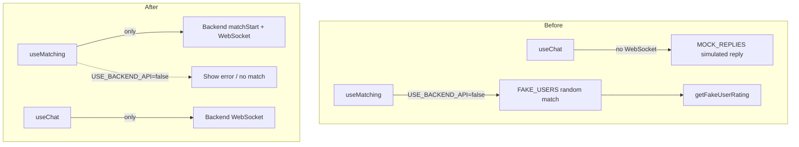

# Remove Bots - Real-Person Matching Only

## Scope

- **Backend (chat-server):** No changes. It already uses only the real-user match queue; there is no bot or fake-user logic.
- **Frontend (StrangerVibes-main):** Remove fake users, simulated matching, and simulated chat; keep only real-person flows.

---

## Architecture Change

---

## Frontend Changes

### 1. [constants/config.ts](e:\aiapp\StrangerVibes-main\constants\config.ts)

- Remove `FAKE_USERS` (lines 11–52)
- Remove `MOCK_USERS` and `MOCK_MESSAGES`
- Keep `APP_CONFIG` only

### 2. [hooks/useMatching.tsx](e:\aiapp\StrangerVibes-main\hooks\useMatching.tsx)

- Remove imports: `FAKE_USERS`, `getFakeUserRating`
- Remove the entire fake-matching branch (lines 75–112)
- When `!USE_BACKEND_API || !user?.id`: set `status: 'error'` and return (show error, do not match)

### 3. [hooks/useChat.tsx](e:\aiapp\StrangerVibes-main\hooks\useChat.tsx)

- Remove `MOCK_REPLIES` (lines 14–25)
- Remove the simulated reply branch in `sendMessage` (lines 119–141)
- When `!USE_BACKEND_API || !sessionId || !ws`: do not send, or show a brief “需要连接后端” message

### 4. [services/sessionService.ts](e:\aiapp\StrangerVibes-main\services\sessionService.ts)

- Delete `getFakeUserRating` (lines 260–277)

### 5. Display fallbacks (replace FAKE_USERS with route params)

| File                                                                                | Current                                               | After                                                                                     |
| ----------------------------------------------------------------------------------- | ----------------------------------------------------- | ----------------------------------------------------------------------------------------- |
| [app/chat/[id].tsx](e:\aiapp\StrangerVibes-main\app\chat[id].tsx)                   | `FAKE_USERS.find()` for avatar, nickname, personality | Use `avatar ?? default`, `nickname ?? '神秘旅人'`, `personality ?? ''` from params only       |
| [app/chat-settings/[id].tsx](e:\aiapp\StrangerVibes-main\app\chat-settings[id].tsx) | Same                                                  | Same                                                                                      |
| [app/user/[id].tsx](e:\aiapp\StrangerVibes-main\app\user[id].tsx)                   | Same in `loadProfile`                                 | Use `nickname ?? '神秘旅人'`, `avatar ?? default`, etc. from params; Supabase fetch for stats |

### 6. `USE_BACKEND_API` behavior

- Keep the env flag so dev can run without backend
- When `USE_BACKEND_API=false`:
  - Matching: do nothing or set `status: 'error'` so UI can show “需要连接后端”
  - Chat: disable send when there is no WebSocket; optionally show a message

---

## Not in Scope

- **template/auth/mock/**: Mock auth for login; not chat/matching bots. No change.
- **constants/api.ts**: Keep `USE_BACKEND_API` as-is.

---

## Files Summary

| Action | File                                                                    |
| ------ | ----------------------------------------------------------------------- |
| Edit   | `constants/config.ts` – remove FAKE_USERS, MOCK_USERS, MOCK_MESSAGES    |
| Edit   | `hooks/useMatching.tsx` – remove fake branch, add error when no backend |
| Edit   | `hooks/useChat.tsx` – remove MOCK_REPLIES and simulated replies         |
| Edit   | `services/sessionService.ts` – remove `getFakeUserRating`               |
| Edit   | `app/chat/[id].tsx` – remove FAKE_USERS, use params only                |
| Edit   | `app/chat-settings/[id].tsx` – same                                     |
| Edit   | `app/user/[id].tsx` – same                                              |

